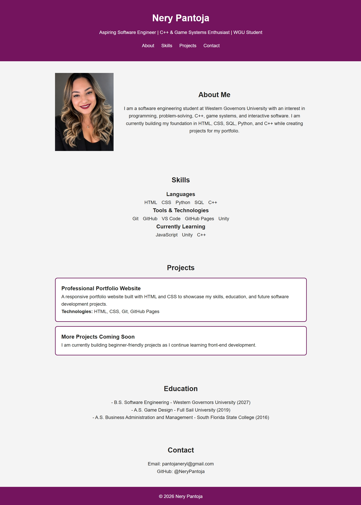

# Personal Portfolio Website

A professional portfolio website created to showcase my skills, education, and future software engineering projects.

## About the Project
This portfolio website is my first front-end project. I am currently building additional beginner projects to add to this portfolio as I continue learning and practicing web development.
This portfolio was designed as a responsive webpage that highlights who I am, my technical skills, and the projects I am working on. It serves as a central place for employers, recruiters, and collaborators to learn more about me and view my work.

## Features

- Responsive design for desktop and mobile screens
- About Me section
- Skills section
- Project showcase
- Contact information
- Clean and simple user interface

## Technologies Used

- HTML
- CSS
- Git
- GitHub
- GitHub Pages

## What I Learned

While building this project, I practiced structuring a webpage with HTML, styling layouts with CSS, making the site responsive, and organizing my code for GitHub. This project helped me strengthen my understanding of front-end development basics.

## Future Improvements

- Add JavaScript for interactive features
- Add more projects
- Improve mobile responsiveness
- Add a downloadable resume

## Live Demo

View the live website here:  
[Portfolio Website](https://nerypantoja.github.io/Portfolio/)

## GitHub Repository

[View Repository](https://github.com/NeryPantoja/Portfolio)

## Screenshots

