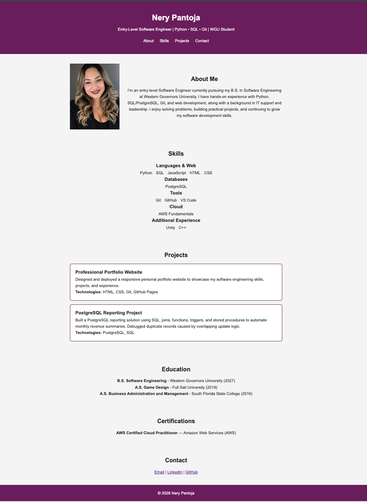

# Personal Portfolio Website

A professional portfolio website created to showcase my skills, education, and future software engineering projects.

## About the Project
This portfolio website serves as a central place for recruiters, employers, and collaborators to learn more about my technical background and view my work. It highlights my experience with software development, databases, web development, and cloud fundamentals.

## Features

- Responsive design for desktop and mobile screens
- About Me section
- Technical skills and tools
- Software and database projects
- Certifications
- Contact Information links
- Clean and simple user interface

## Technologies Used

- HTML
- CSS
- Git
- GitHub
- GitHub Pages

## Projects Featured

### PostgreSQL Reporting Project
Built a PostgreSQL reporting solution using SQL, joins, functions, triggers, and stored procedures to automate monthly revenue summaries. Debugged duplicate records caused by overlapping update logic.

### Responsive Portfolio Website
Designed and deployed this responsive portfolio website to showcase my software engineering skills, projects, and experience.

## What I Learned

While building and maintaining this portfolio, I practiced structuring webpages with HTML, creating responsive layouts with CSS, managing changes with Git and GitHub, and deploying a live site through GitHub Pages.

## Future Improvements

- Add JavaScript-based interactive features
- Add additional software engineering projects
- Add a navigation bar to support additional portfolio pages
- Continue improving mobile responsiveness and accessibility
- Add a downloadable resume

## Live Demo

View the live website here:  
[Portfolio Website](https://nerypantoja.github.io/Portfolio/)

## GitHub Repository

[View Repository](https://github.com/NeryPantoja/Portfolio)

## Screenshots

